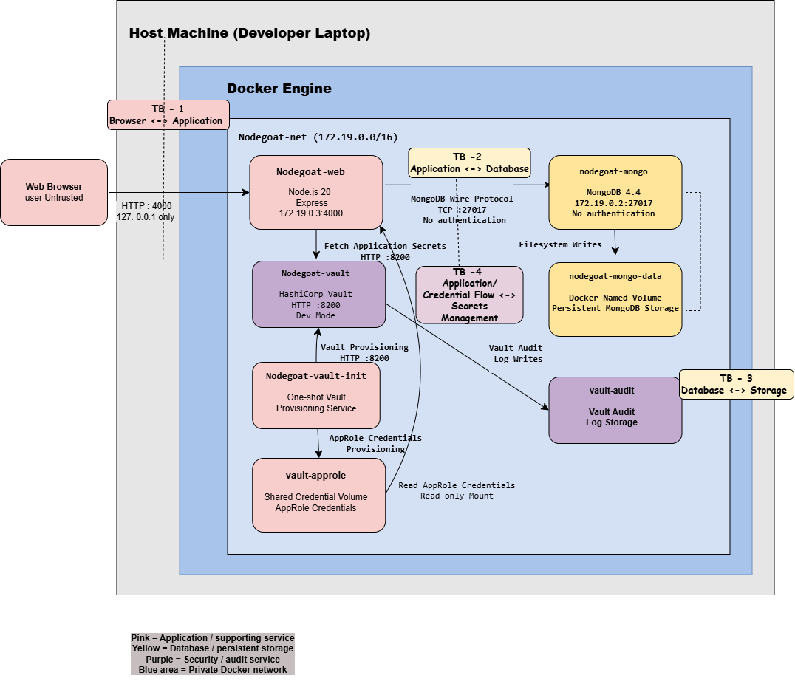
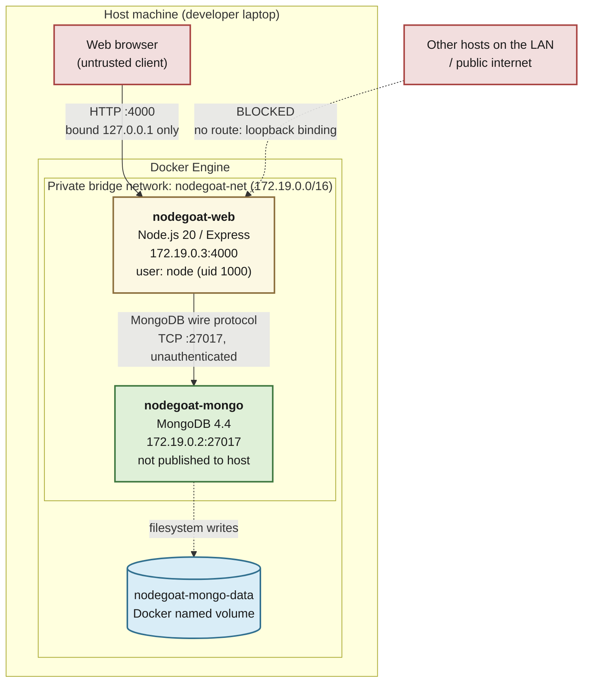
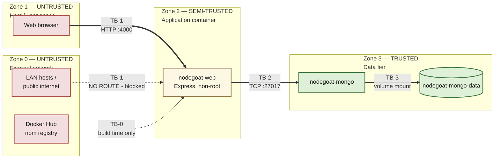
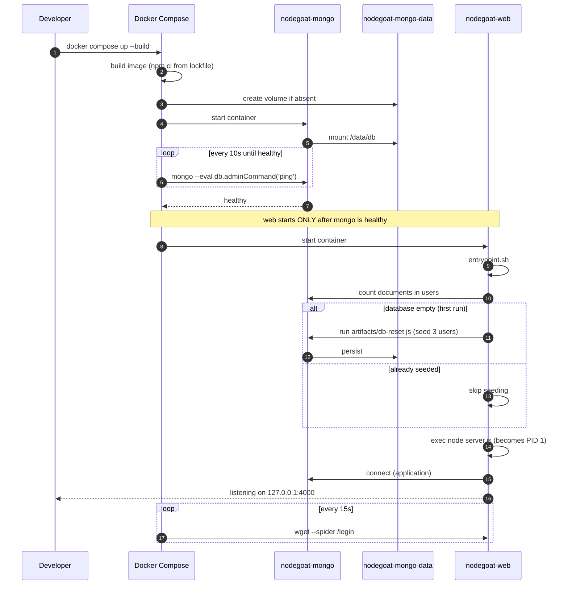

# Architecture — IE3142 NodeGoat DevSecOps (Phase 1)

Architecture of the containerised OWASP NodeGoat deployment: every component,
every data flow between them, and the trust boundaries that separate them.

## Architecture Diagram

**Scope.** This documents the Phase 1 deployment architecture as actually built
and verified. It does **not** cover the CI/CD pipeline or scanning gates (later
phase), and it is **not** a threat model — it provides the boundaries a threat
model would be built on, but identifying and rating threats is owned separately.

**Status.** Every port, protocol, address and boundary below was verified against
the running stack with `docker inspect`, `docker network inspect` and live HTTP
requests. Nothing here is assumed. Verification commands are in
[Appendix A](#appendix-a--how-each-claim-was-verified).

---

## Contents

- [1. System overview](#1-system-overview)
- [2. Components](#2-components)
- [3. Data flows](#3-data-flows)
- [4. Trust boundaries](#4-trust-boundaries)
- [5. Startup sequence](#5-startup-sequence)
- [6. Data persistence](#6-data-persistence)
- [7. Redraw specification](#7-redraw-specification)
- [8. Known weaknesses and deferred work](#8-known-weaknesses-and-deferred-work)
- [Appendix A — how each claim was verified](#appendix-a--how-each-claim-was-verified)

---

## 1. System overview

Two containers on one private bridge network. Only the web application is
reachable from the host; the database is not published at all.

**Colour key.** Red = untrusted, yellow = semi-trusted (internet-facing, and in
this case deliberately vulnerable), green = trusted internal, blue = data store.

---

## 2. Components

| # | Component | Container | Image | Role |
|---|---|---|---|---|
| C1 | **Web application** | `nodegoat-web` | `nodegoat-devsec/web:local` (built from `Dockerfile`) | Serves the NodeGoat retirement-savings app. Handles HTTP, renders templates, manages sessions, performs all database access. The only component reachable from outside Docker. |
| C2 | **Database** | `nodegoat-mongo` | `mongo:4.4` | Persists users, allocations, contributions, memos and counters. Reachable **only** from C1. |
| C3 | **Named volume** | — | `nodegoat-mongo-data` | Docker-managed storage backing `/data/db`. Survives container removal. |
| C4 | **Bridge network** | — | `nodegoat-net` (172.19.0.0/16) | Private L2 segment. Provides service-name DNS (`mongo` resolves to C2). |

### C1 — Web application, in detail

| Property | Value |
|---|---|
| Runtime | Node.js **v20.20.2**, npm 10.8.2 |
| Framework | Express 4 |
| Template engine | Swig (via Consolidate) |
| Session store | `express-session` **in-memory** (see [§8](#8-known-weaknesses-and-deferred-work)) |
| DB driver | `mongodb` 2.x |
| Listening on | `0.0.0.0:4000` *inside* the container |
| Published as | `127.0.0.1:4000` on the host |
| Process user | `node` (uid 1000, gid 1000) — **non-root** |
| Entrypoint | `docker/entrypoint.sh` → `node server.js` (PID 1) |
| Healthcheck | `wget --spider http://127.0.0.1:4000/login` every 15s |
| Image size | ~235 MB |

Built as a **two-stage** image: stage 1 resolves production dependencies with
`npm ci` against `package-lock.json`; stage 2 copies only the resulting
`node_modules` plus application source. The npm cache and dev dependencies never
reach the runtime image.

### C2 — Database, in detail

| Property | Value |
|---|---|
| Version | MongoDB **4.4.30** |
| Database name | `nodegoat` |
| Listening on | `0.0.0.0:27017` *inside* the container |
| Published to host | **No mapping at all** — `docker inspect` reports `"27017/tcp": null` |
| Authentication | **None** (no `--auth`, no users configured) |
| Data path | `/data/db` → volume `nodegoat-mongo-data` |
| Healthcheck | `mongo --eval "db.adminCommand('ping')"` every 10s |

Collections: `users`, `allocations`, `contributions`, `memos`, `counters`.

> **Why is the database unauthenticated?** Because it is unreachable from
> anywhere except C1. Network isolation is the control here, not credentials.
> This is a deliberate, defensible trade-off for a local lab — but it means
> **the network boundary is the only thing protecting the data**, so anything
> that lets an attacker execute code inside C1 gives them full database access.
> Enabling authentication is listed in [§8](#8-known-weaknesses-and-deferred-work).

> **Why MongoDB 4.4 and not a current release?** MongoDB 5.0+ requires a CPU with
> AVX support; machines without it crash-loop on startup. 4.4 keeps the stack
> runnable across all four team members' hardware. 4.4 is end-of-life (Feb 2024),
> which is an accepted, documented risk for a local-only lab environment.

---

## 3. Data flows

Every flow in the system. **Direction** is the initiator, so `A → B` means A
opens the connection.

| # | From | To | Protocol | Port | Auth | Data carried | Crosses |
|---|---|---|---|---|---|---|---|
| **F1** | Browser | `nodegoat-web` | HTTP/1.1 (**cleartext**) | `127.0.0.1:4000` → `4000/tcp` | Session cookie `connect.sid` | Credentials at login, form submissions, HTML/CSS/JS responses | **TB-1** |
| **F2** | `nodegoat-web` | `nodegoat-mongo` | MongoDB wire protocol (TCP, **cleartext**) | `172.19.0.2:27017` | **None** | Queries and results: user records, plaintext passwords, allocations, memos | **TB-2** |
| **F3** | `nodegoat-mongo` | `nodegoat-mongo-data` | Filesystem (volume mount) | n/a | Docker-enforced | WiredTiger data files at `/data/db` | **TB-3** |
| **F4** | Docker Engine | `nodegoat-web` | `wget` inside container | `127.0.0.1:4000` | None | Healthcheck probe (`/login`) | internal |
| **F5** | Docker Engine | `nodegoat-mongo` | `mongo --eval` inside container | local socket | None | Healthcheck probe (`adminCommand('ping')`) | internal |
| **F6** | `nodegoat-web` (entrypoint) | `nodegoat-mongo` | MongoDB wire protocol | `172.19.0.2:27017` | **None** | One-off seed on first start: counts `users`, inserts defaults if empty | **TB-2** |
| **F7** | *(build time only)* | Docker Hub / npm registry | HTTPS | 443 | None | Base images, npm packages | **TB-0** |

### Notes on individual flows

**F1 is cleartext HTTP, not HTTPS.** Login credentials cross this link in the
clear. Because it is bound to `127.0.0.1`, traffic never leaves the loopback
interface, so there is no network path to intercept it on the LAN. NodeGoat
ships TLS support, but the code is commented out at `server.js:21-27` and the
bundled certificate (`artifacts/cert/server.crt`) expired 2016-04-24. This is
one of NodeGoat's intentional vulnerabilities (A6 — Sensitive Data Exposure),
not an oversight in our deployment.

**F2 carries plaintext passwords.** `artifacts/db-reset.js:18,27,35` seeds
passwords unhashed (the bcrypt hashes are present but commented out). Intentional
upstream behaviour, demonstrating A2 — Broken Authentication.

**F7 is build-time only.** Once images are built, the running application makes
**no outbound connections whatsoever**. All front-end assets (Bootstrap, jQuery,
Font Awesome, Morris, Raphael) are served from `app/assets/vendor/` — verified by
inspecting every `<script>` and `<link>` tag in `app/views/layout.html`. There is
no CDN, no cloud database and no third-party service at runtime, which satisfies
the offline requirement.

**One exception to "no outbound connections":** `app/routes/research.js:15-16`
performs `needle.get()` against a **user-supplied URL**. This is NodeGoat's
deliberate SSRF vulnerability. It fires only when a user submits a crafted
request and does not affect normal offline operation, but it means the
application *can be induced* to make arbitrary outbound requests from inside the
Docker network. Relevant to threat modelling; owned by another team member.

---

## 4. Trust boundaries

A trust boundary is where data moves between zones of differing trust, and
therefore where validation, authentication or isolation must be enforced.

### TB-1 — Public / host ⟷ Application

**The primary attack surface.** Everything crossing it is attacker-controlled.

| | |
|---|---|
| **Separates** | Browser (untrusted) from the application container (semi-trusted) |
| **Crossed by** | F1 |
| **Enforced by** | Docker port publication bound to `127.0.0.1:4000` |
| **Verified** | `docker inspect` → `{"4000/tcp":[{"HostIp":"127.0.0.1","HostPort":"4000"}]}` |

**Controls present**
- Bound to loopback only, so no host on the LAN can route to it.
- Session-based authentication; `isLoggedIn` middleware guards protected routes
  (`app/routes/index.js:44-76`). Verified: `GET /dashboard` unauthenticated
  returns `302 → /login`.
- `isAdmin` middleware guards administrative routes.
- Application runs as a non-root user, so container compromise does not yield root.

**Controls deliberately absent** (NodeGoat's intentional vulnerabilities — owned
by another team member, listed here only because a boundary analysis must be honest)
- No TLS. Credentials cross in cleartext.
- CSRF protection commented out (`server.js:7`).
- Helmet security headers commented out (`server.js:10, 38-60`).
- Input validation weak or missing on several routes.
- Login error messages distinguish "invalid user" from "invalid password"
  (`app/routes/session.js:59-61`), enabling username enumeration. Verified live.

### TB-2 — Application ⟷ Database

| | |
|---|---|
| **Separates** | Application container (semi-trusted) from data tier (trusted) |
| **Crossed by** | F2, F6 |
| **Enforced by** | Docker network isolation — `expose`, never `ports` |
| **Verified** | `docker inspect` → `"27017/tcp": null`; host connection to 27017 refused; connection from inside `nodegoat-web` succeeds |

**Controls present**
- **No host port mapping.** The database has no published port, so it cannot be
  reached from the host, the LAN or the internet. This is the single most
  important control on this boundary.
- Private bridge network; only containers attached to `nodegoat-net` can resolve
  or reach `mongo`.
- Service-name DNS rather than hardcoded IPs, so no address leaks into config.

**Controls absent**
- **No database authentication.** Any process that reaches the network can read
  and write everything.
- **No TLS** on the wire; traffic within the Docker bridge is cleartext.
- **No authorisation model** — the app connects with implicit full privilege
  rather than a least-privilege account scoped to the `nodegoat` database.

> **Consequence, stated plainly:** TB-2's entire strength is network isolation.
> Any vulnerability that yields code execution or request forgery inside C1 —
> and NodeGoat ships several, including SSRF — collapses this boundary
> completely. For a local lab this is acceptable and documented; it would not be
> acceptable in a deployed system.

### TB-3 — Database ⟷ Persistent storage

| | |
|---|---|
| **Separates** | Database process from host filesystem |
| **Crossed by** | F3 |
| **Enforced by** | Docker volume driver; the container sees only `/data/db` |
| **Verified** | `docker inspect` → `volume nodegoat-mongo-data → /data/db` |

The container cannot reach arbitrary host paths — only the volume Docker mounts
for it. Volume contents persist across `docker compose down` and are destroyed
only by `docker compose down -v`.

### TB-0 — Build-time supply chain

| | |
|---|---|
| **Separates** | Local build from external registries |
| **Crossed by** | F7 (build time only) |
| **Enforced by** | HTTPS to Docker Hub and the npm registry |

`npm ci` installs the exact tree pinned in `package-lock.json` and fails on
lockfile drift, so every team member builds an identical dependency set. Base
images are pinned by **tag** (`node:20-alpine`, `mongo:4.4`) but **not by
digest**, so a tag could in principle be repointed upstream. Digest pinning and
supply-chain scanning belong to a later phase.

---

## 5. Startup sequence

Ordering is enforced declaratively by healthchecks, not by sleeps or retry loops.

Two design points worth noting:

1. **`depends_on: condition: service_healthy`** means Compose will not start the
   application until the database reports healthy. Upstream instead used
   `until nc -z mongo 27017 ... do sleep 2; done` in the container command — and
   because `npm start` sat *inside* that loop's condition, an application crash
   re-entered the loop and silently re-seeded the database.

2. **`exec "$@"`** in the entrypoint replaces the shell with the Node process, so
   the application becomes PID 1 and receives `SIGTERM` directly on
   `docker compose stop`. Without `exec`, the shell would absorb the signal and
   Docker would fall back to `SIGKILL` after its timeout.

---

## 6. Data persistence

| Action | Containers | Network | Volume / data |
|---|---|---|---|
| `docker compose stop` | stopped | kept | **kept** |
| `docker compose down` | removed | removed | **kept** |
| `docker compose down -v` | removed | removed | **destroyed** |
| `docker compose exec web node artifacts/db-reset.js` | running | kept | **collections dropped and re-seeded** |

Seeding is **conditional**: `docker/seed-if-empty.js` counts the `users`
collection and seeds only when it is empty. Resetting is therefore an explicit
operator action, never a side effect of starting the stack.

`artifacts/db-reset.js` is left exactly as OWASP ships it, so it remains usable
as the documented reset command.

---

## 7. Redraw specification

For redrawing in draw.io, Lucidchart, Visio or similar. Every node and edge is
listed explicitly so the diagram can be reproduced without reading the prose.

### Nodes

| ID | Label | Shape | Zone | Fill | Stroke |
|---|---|---|---|---|---|
| `N1` | Web browser | Rounded rectangle | Zone 1 — untrusted | `#f2dede` | `#a94442` |
| `N2` | LAN hosts / internet | Cloud | Zone 0 — untrusted | `#f2dede` | `#a94442` |
| `N3` | **nodegoat-web** Node.js 20 / Express 172.19.0.3:4000 | Rectangle | Zone 2 — semi-trusted | `#fcf8e3` | `#8a6d3b` |
| `N4` | **nodegoat-mongo** MongoDB 4.4 172.19.0.2:27017 | Rectangle | Zone 3 — trusted | `#dff0d8` | `#3c763d` |
| `N5` | nodegoat-mongo-data | Cylinder (database) | Zone 3 — trusted | `#d9edf7` | `#31708f` |
| `N7` | **nodegoat-vault** HashiCorp Vault 2.1.0 / :8200 | Rectangle | Zone 3 – trusted | `#dff0d8` | `#3c763d` |
| `N8` | **nodegoat-vault-init** One-shot Vault provisioning service | Rectangle | Zone 3 – trusted | `#dff0d8` | `#3c763d` |
| `N9` | vault-approle | Cylinder (storage) | Zone 3 – trusted | `#d9edf7` | `#31708f` |
| `N10` | vault-audit | Cylinder (storage) | Zone 3 – trusted | `#d9edf7` | `#31708f` |

### Containers / groupings (draw as nested boxes)

| ID | Label | Contains |
|---|---|---|
| `G1` | Host machine (developer laptop) | `N1`, `G2` |
| `G2` | Docker Engine | `G3`, `N5`, `N9`, `N10` |
| `G3` | Private bridge network: `nodegoat-net` (172.19.0.0/16) | `N3`, `N4`, `N7`, `N8` |

### Edges

| ID | From → To | Label | Line style |
|---|---|---|---|
| `F1` | `N1` → `N3` | `HTTP :4000 (cleartext)` bound 127.0.0.1 | Solid arrow, **thick** |
| `F2` | `N3` → `N4` | `MongoDB wire protocol` `TCP :27017, no auth` | Solid arrow, **thick** |
| `F3` | `N4` → `N5` | `filesystem writes` | Solid arrow, thin |
| `F7` | `N6` → `N3` | `HTTPS :443 (build time only)` | **Dashed** arrow, thin |
| `F8` | `N8` → `N7` | `Vault provisioning / HTTP :8200` | Solid arrow, **thick** |
| `F9` | `N7` → `N8` | `AppRole credentials provisioning` | Solid arrow, thin |
| `F10` | `N3` → `N7` | `Fetch application secrets / HTTP :8200 (private Docker network)` | Solid arrow, **thick** |
| `F11` | `N8` → `N9` | `Write AppRole credentials to shared volume` | Solid arrow, thin |
| `F12` | `N9` → `N3` | `Read AppRole credentials (read-only mount)` | Solid arrow, thin |
| `F13` | `N7` → `N10` | `Vault audit log writes` | Solid arrow, thin |

### Trust boundary lines (draw as labelled dashed lines cutting the edges)

| ID | Cuts edge | Label | Style |
|---|---|---|---|
| `TB-1` | `F1` | Public / host ⟷ Application | Red dashed, thick |
| `TB-2` | `F2` | Application ⟷ Database | Orange dashed, thick |
| `TB-3` | `F3` | Database ⟷ Storage | Blue dashed, thin |
| `TB-0` | `F7` | Build-time supply chain | Grey dashed, thin |
| `TB-4` | `F10`, `F11`, `F12` | Application ↔ Secrets Management | Purple dashed, thick |

### Layout suggestion

Left-to-right layout: place `N2/N1` on the left, followed by `N3` (NodeGoat web), then `N4` (MongoDB) and `N5` (MongoDB persistent storage). Place `N7` (Vault) below `N3`, with `N8` (vault-init) beside it and `N9` (vault-approle storage) between the Vault services and the web application. Place `N10` (vault-audit storage) below `N7`.

Draw the runtime trust boundaries between the browser/application, application/database, database/storage, and application/secrets-management areas. Place `N6` (Docker Hub / npm registry) above `N3` and connect it using the dashed build-time-only `F7` edge so that the supply-chain interaction is clearly separated from runtime traffic.

---

## 8. Known weaknesses and deferred work

Split into two categories, because they are owned by different people.

### 8.1 Deployment/infrastructure weaknesses (this phase's responsibility)

Accepted, documented trade-offs in the architecture as built:

| Item | Risk | Why accepted now | Later phase |
|---|---|---|---|
| MongoDB has no authentication | Full data access to anything reaching the network | Isolated by TB-2; local lab only | Enable `--auth` with a least-privilege user |
| MongoDB 4.4 is end-of-life | Unpatched database CVEs | 5.0+ requires AVX; would break team hardware | Re-evaluate; pin by digest |
| Base images pinned by tag, not digest | A tag could be repointed upstream | Readability and maintenance | Digest-pin and scan images |
| No TLS anywhere | Cleartext credentials and queries | Loopback-only binding; TLS is an intentional NodeGoat lesson | Out of scope — belongs to remediation |
| Secrets exposure or insecure secret handling | Session and cryptographic secrets could be disclosed if stored in source code, logs, or insecure environment configuration | Secrets are externalised from committed source; `.env` is git-ignored, and optional Vault/AppRole provides runtime secret retrieval on the private Docker network | Keep secrets out of source control, use Vault/AppRole where configured, restrict secret access using least privilege, and verify with the secrets-scanning CI gate |
| No resource limits on containers | A runaway container could exhaust host resources | Local dev convenience | Add `deploy.resources.limits` |
| In-memory session store | Sessions lost on restart; will not scale | Single instance; upstream default | Out of scope for this module |
| Vault runs in development mode | Vault dev mode stores data in memory, auto-unseals, and is not suitable for production deployment | The project is an offline local teaching environment; Vault is used to demonstrate secrets management without requiring external infrastructure | For production, deploy Vault with persistent encrypted storage, proper initialization and unsealing, TLS, restricted administrative access, and appropriate high-availability configuration |

### 8.2 Application vulnerabilities (owned by other team members)

NodeGoat is **deliberately vulnerable** and its application code is unmodified.
Injection, XSS, broken access control, SSRF, insecure deserialisation and
vulnerable dependencies are all present **by design**. They are listed here only
so that this document's boundary analysis is not mistaken for a claim that the
application is secure. Identifying, rating and remediating them is owned
separately.

### 8.3 Secrets management options under consideration

Recorded here so the later-phase decision has a written starting point.

| Option | Strengths | Weaknesses |
|---|---|---|
| **`.env` + `env_file`** | Minimal change; clean before/after for the scanning gate; no new infrastructure | Env vars visible via `docker inspect` and in crash dumps |
| **Docker secrets (`_FILE` convention)** | Mounted as files, not env vars; not in `inspect` output | More moving parts; needs Swarm or bind-mounted files in plain Compose |
| **External vault (Vault, SOPS + age)** | Closest to industry practice; auditable; supports rotation | **Conflicts with the offline requirement** unless self-hosted in-compose; heaviest option |

---

## Appendix A — how each claim was verified

Every factual claim in this document was checked against the running stack.

| Claim | Command | Result |
|---|---|---|
| App published on loopback only | `docker inspect nodegoat-web --format '{{json .NetworkSettings.Ports}}'` | `{"4000/tcp":[{"HostIp":"127.0.0.1","HostPort":"4000"}]}` |
| Database not published at all | `docker inspect nodegoat-mongo --format '{{json .NetworkSettings.Ports}}'` | `{"27017/tcp":null}` |
| Host cannot reach the database | `curl -m 4 http://localhost:27017/` | connection refused |
| App *can* reach the database | `docker compose exec web node -e "...count()"` | `OK, 3 users visible` |
| Container IPs and subnet | `docker network inspect nodegoat-net` | web `172.19.0.3`, mongo `172.19.0.2`, subnet `172.19.0.0/16` |
| Volume mount target | `docker inspect nodegoat-mongo --format '{{range .Mounts}}...'` | `volume nodegoat-mongo-data -> /data/db` |
| App runs as non-root | `docker compose exec web id` | `uid=1000(node) gid=1000(node)` |
| Runtime versions | `docker compose exec web node --version` / `mongo --eval 'db.version()'` | `v20.20.2` / `4.4.30` |
| Auth actually enforced | `curl /dashboard` without a cookie | `302 → /login` |
| Login works end to end | `curl -d "userName=admin&password=Admin_123" /login` | `302 → /benefits`, `connect.sid` issued |
| Username enumeration present | `curl` with a valid user and wrong password | `Invalid password` (distinct from `Invalid username and/or password`) |
| Data persists across `down` | marker document written, `down`, `up`, re-queried | marker found; `users` still 3 |
| Seeding is conditional | `docker compose logs web` after restart | `[seed] Database already contains 3 user(s) - skipping seed.` |
| Reset works | `docker compose exec web node artifacts/db-reset.js` | collections dropped, re-seeded, marker gone |
| No CDN dependency | inspected every `<script>` / `<link>` in `app/views/layout.html` | all local `/vendor/…` and `/js/…` paths |

---

*Phase 1 of the IE3142 DevOps Security group assignment. Application based on
[OWASP NodeGoat](https://github.com/OWASP/NodeGoat) at commit `c5cb68a`,
Apache License 2.0. See the [README](../README.md) for full attribution.*
