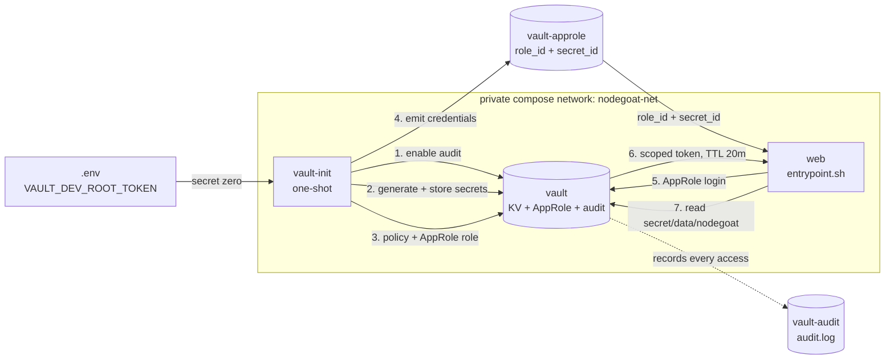

# Secrets Management — IE3142 NodeGoat DevSecOps (Phase 5)

How secrets are provisioned to the running application and to the CI pipeline,
what remains hardcoded and why, and the limitations we could not remove.

**Scope.** This documents secrets *provisioning*. It is not a threat model, and
it does not remediate NodeGoat's application vulnerabilities — those are owned
separately and are deliberately left intact.

---

## Contents

- [1. Summary](#1-summary)
- [2. Complete inventory](#2-complete-inventory)
- [3. Application secrets at runtime](#3-application-secrets-at-runtime)
- [4. HashiCorp Vault](#4-hashicorp-vault)
- [5. Pipeline secrets](#5-pipeline-secrets)
- [6. What remains hardcoded, and why](#6-what-remains-hardcoded-and-why)
- [7. Git history](#7-git-history)
- [8. Known limitations](#8-known-limitations)
- [Appendix A — verification evidence](#appendix-a--verification-evidence)

---

## 1. Summary

| Consumer | Mechanism | Enforced by |
|---|---|---|
| Running application | Environment variables injected by `docker-compose.yml` from a git-ignored `.env` | `.gitignore`; no defaults for secrets |
| Running application (preferred) | **HashiCorp Vault** via **AppRole**, fetched at container start | `docker/vault-init.sh`, `docker/vault-fetch.js` |
| CI pipeline | **GitHub Actions encrypted secrets** (Docker Hub credentials only) | `.github/workflows/ci.yml` |
| Detection | **Gitleaks**, enforcing gate, full git history | `.gitleaksignore` baseline |

Three layers of fallback, most to least preferred:

```
Vault (AppRole)  →  environment / .env  →  randomly generated ephemeral key
```

There is **no hardcoded secret anywhere in the fallback chain**. If every source
is absent, the application generates a random key and warns — it never falls
back to a literal.

---

## 2. Complete inventory

Produced before any code was changed. Every credential, key, connection string
and secret in the repository, classified by whether it is actually live.

### Live application secrets

| Item | Location (before) | Used at | Status |
|---|---|---|---|
| `cookieSecret` | `config/env/all.js:8` | Runtime — `server.js:17`, `server.js:82` (express-session signing key) | **Moved to `SESSION_SECRET`** |
| Config printed to stdout | `config/config.js:12-13` | Runtime, every startup | **Redacted** |

`cookieSecret` was the only genuinely live application secret in the repository.

### Dead config — looks like a secret, never executes

| Item | Location | Why dead | Status |
|---|---|---|---|
| `cryptoKey` | `config/env/all.js:9` | Only referenced at `profile-dao.js:26,32,37`, all inside the commented-out `/* Fix for A6 */` block (lines 15–40) | Moved to `CRYPTO_KEY` pre-emptively |
| `cryptoAlgo` | `config/env/all.js:10` | Same block. Also not a secret — an algorithm name | Left in source |

Corroborating evidence: `config.iv` is referenced at `profile-dao.js:32,37` but
is **defined nowhere**. If that code executed, `createCipheriv` would throw. It
does not execute.

### Connection strings

| Item | Location | Status |
|---|---|---|
| `mongodb://localhost:27017/nodegoat` | `config/env/all.js:3` | Fallback only; overridden by `MONGODB_URI`. **Contains no credentials** — MongoDB is unauthenticated behind trust boundary TB-2 |

### Tooling-only — for a suite that cannot run

| Item | Location | Consumer |
|---|---|---|
| `zapApiKey` | `config/env/development.js:6`, `config/env/test.js:6` | `test/security/profile-test.js` |
| `zapHostName`, `zapPort` | `development.js:3-4`, `test.js:3-4` | same |
| `sutUserPassword` | `test/security/profile-test.js:37` | same |

The ZAP suite requires a proxy at a hardcoded VirtualBox address
(`192.168.56.20:8080`) and an undeclared `chromedriver`. It cannot run here.

### Deliberately public demo data

| Item | Location |
|---|---|
| `Admin_123`, `User1_123`, `User2_123` | `artifacts/db-reset.js:18,27,35` (seeded **plaintext**; bcrypt hashes commented out at `:19,28,36`) |
| Fixture passwords | `test/e2e/fixtures/users/*.json` |

### Documentation samples — not config

| Item | Location |
|---|---|
| `secret: "s3Cur3"` | `app/views/tutorial/a2.html:153`, `a3.html:176` — inside `<pre>` teaching blocks |

### Untracked

| Item | Status |
|---|---|
| `artifacts/cert/server.key` (RSA private key) | On disk, **never committed** — `.gitignore` rule `*.key` caught it at import. Cert expired 2016-04-24; its consumer is commented out at `server.js:21-27` |

---

## 3. Application secrets at runtime

### Mechanism

```
.env  (git-ignored)
  ↓  docker-compose.yml  environment:
        SESSION_SECRET: ${SESSION_SECRET:-}
        CRYPTO_KEY:     ${CRYPTO_KEY:-}
  ↓  container environment
  ↓  config/env/all.js  →  process.env.SESSION_SECRET
  ↓  server.js:82       →  session({ secret: cookieSecret })
```

### No defaults for secrets — deliberately

Every **non-secret** variable in `docker-compose.yml` uses `${VAR:-default}` so
the stack runs from a fresh clone. **Secrets use `${VAR:-}` with no default**,
because a default secret committed to the repository is precisely the problem
being removed.

When a secret variable is absent, `config/env/all.js` generates a random 32-byte
value for that process and warns:

```
[config] SESSION_SECRET is not set - generated an ephemeral random value for this process.
[config] Set SESSION_SECRET in .env for a stable key. See .env.example.
```

An unset variable therefore **cannot silently produce a predictable secret**.
The trade-off is that sessions do not survive a container restart until a stable
value is set — the safer default for a lab.

### `.env` vs `.env.example`

| File | Committed? | Contains |
|---|---|---|
| `.env` | **No** — `.gitignore:28` | Real values, local only |
| `.env.example` | **Yes** | Variable names, purposes, generation instructions. **Never values** |

### Log redaction

`config/config.js` prints the resolved config on startup — useful for debugging,
and referenced by the README troubleshooting section. Provisioning a key from
the environment achieves nothing if the container prints it on every boot, since
container logs are shipped, aggregated and shared. The structure is still
logged; the values of `cookieSecret`, `cryptoKey` and `zapApiKey` are masked:

```
cookieSecret: '***REDACTED***',
cryptoKey: '***REDACTED***',
```

---

## 4. HashiCorp Vault

An optional, additive source of secrets that takes precedence over `.env`.

### Architecture



### What `vault-init` does

1. Enables a **file audit device**
2. **Generates** `session_secret` and `crypto_key` from `/dev/urandom` and writes
   them to `secret/nodegoat` — the values never exist in any repository file
3. Writes a **least-privilege policy**: `read` on `secret/data/nodegoat`, nothing else
4. Enables **AppRole** and creates role `nodegoat-app`
   (`token_ttl=20m`, `token_max_ttl=1h`, `secret_id_ttl=30m`)
5. Emits `role_id` and `secret_id` to a shared volume

### What the application does

`docker/entrypoint.sh` runs `docker/vault-fetch.js` before starting the app. It
authenticates with AppRole, reads the secret, writes shell exports to a file,
and the entrypoint sources and deletes that file.

`vault-fetch.js` uses **Node 20's global `fetch`** — no `node-vault`, no `curl`,
so the runtime image and the production dependency tree are unchanged.

### Why AppRole rather than the root token

| | Root token | AppRole |
|---|---|---|
| Scope | Everything in Vault | One read-only path |
| Expiry | Never | Token 20m, credential 30m |
| Revocable | Only by revoking root | Per-role, centrally |
| Identity | None | `role_id` identifies the workload |

`role_id` is an **identity** (comparable to a username) and is not secret.
`secret_id` is the **credential**. Requiring both is what makes this
identity-based access rather than a shared password.

### What Vault provides that `.env` cannot

| Capability | `.env` | Vault |
|---|---|---|
| Secret absent from all files on disk | ✗ | ✅ generated inside Vault |
| Absent from `docker inspect` | ✗ | ✅ verified 0 occurrences |
| Audit trail of every access | ✗ | ✅ identity, path, timestamp |
| Credential expiry / TTL | ✗ | ✅ |
| Central revocation | ✗ | ✅ |
| Central rotation | ✗ (every machine) | ✅ one place |

The audit log distinguishes provisioning from application access:

```
policies ["root"],                     display_name "token"    ← vault-init
policies ["default","nodegoat-app"],   display_name "approle"  ← the application
```

### Vault is additive and never fatal

`vault-fetch.js` **always exits 0**. If Vault is absent, unreachable, or
`VAULT_DEV_ROOT_TOKEN` is unset, it logs the reason and the app falls back. A
secrets manager that can stop the stack from starting is a worse outcome than
one that is optional.

### Enabling it

```bash
cp .env.example .env
echo "VAULT_DEV_ROOT_TOKEN=dev-root-$(openssl rand -hex 12)" >> .env
docker compose up -d --wait
docker compose logs vault-init
```

Leave `SESSION_SECRET` and `CRYPTO_KEY` blank — Vault supplies them.

---

## 5. Pipeline secrets

### Honest position: the pipeline needs almost none

Every security gate was **chosen** to be credential-free:

| Gate | Tool | Credential-free because |
|---|---|---|
| SAST | Semgrep | Community rules, `--metrics=off`, no `SEMGREP_APP_TOKEN` |
| Dependency | npm audit | Chosen over Snyk specifically to avoid `SNYK_TOKEN` |
| Secrets | Gitleaks container | Chosen over `gitleaks-action`, which needs `GITLEAKS_LICENSE` for orgs |
| Container | Trivy | No authentication required |

`GITHUB_TOKEN` is injected automatically and is not a repository secret. The
workflow restricts it to `permissions: contents: read`, widened to
`security-events: write` **only** on the `sast` job.

### The one genuine need

| Secret | Purpose |
|---|---|
| `DOCKERHUB_USERNAME` | Docker Hub account name |
| `DOCKERHUB_TOKEN` | Docker Hub **access token** (not a password) |

The workflow pulls **five** images per run: `node:20-alpine`, `mongo:4.4`,
`semgrep/semgrep`, `zricethezav/gitleaks`, `aquasec/trivy`. Docker Hub
rate-limits **anonymous** pulls per source IP, and GitHub-hosted runners share
NAT'd address ranges — a known cause of intermittent `toomanyrequests` failures.
Authenticating raises the limit.

This is a reliability need, not an invented use of the feature.

### How they are handled

| Practice | Reason |
|---|---|
| `${{ secrets.* }}` only in the workflow-level `env:` block | Interpolating a secret into a `run:` body inlines the literal into the shell script — a script-injection risk |
| `--password-stdin` | A token as a CLI argument appears in the process list and shell traces |
| Never echoed | The step prints only the username |
| Optional | Absent secrets → log and `exit 0`; works on forks and PRs without secret access |
| Added to 5 jobs only | `lint`, `dependency-scan`, `ci-status` pull no images |

### Adding them

1. Docker Hub → **Account Settings → Personal access tokens → Generate new token**
   (permissions: **Public Repo Read-only**)
2. GitHub → repo → **Settings → Secrets and variables → Actions → New repository secret**
3. Add `DOCKERHUB_USERNAME` and `DOCKERHUB_TOKEN`

---

## 6. What remains hardcoded, and why

Removing these would be worse than leaving them.

| Item | Location | Why retained |
|---|---|---|
| `zapApiKey` | `config/env/development.js:6`, `test.js:6` | **The demonstration finding for the Gitleaks gate.** Tooling-only for an unrunnable suite. Removing it destroys the demo and reduces no real risk. Baselined by exact fingerprint. |
| Seeded passwords | `artifacts/db-reset.js:18,27,35` | Published upstream, documented in README, and relied on by `scripts/smoke-test.sh`. Moving them would break a working test for no security gain. |
| Fixture passwords | `test/e2e/fixtures/users/*.json` | Cypress fixtures for a suite that cannot run. |
| Tutorial samples | `app/views/tutorial/a2.html:153`, `a3.html:176` | Documentation. Changing them damages the teaching material. |
| `cryptoAlgo` | `config/env/all.js` | An algorithm name, not a secret. |

### Baseline, not suppression

`.gitleaksignore` lists **2 entries**, each an exact fingerprint
(`commit:file:rule:line`) with a written justification, plus a rule:

> **Never add an entry to make a red build go green.** If the gate fires, a new
> secret has been introduced — remove the secret, do not baseline it.

Exact fingerprints mean each entry covers **one specific finding**. A different
secret in the same file, or the same secret in a new commit, still fails the
build. The file is committed and reviewable, and every scan report is uploaded
as a CI artifact.

Verified after every change in this phase: **0 stale entries, 0 unbaselined
findings.** A stale entry — one kept after the secret was removed — would be
exactly the silent suppression this project committed to avoiding.

---

## 7. Git history

**The old hardcoded values remain in git history, and we chose not to rewrite it.**

### Why

1. **Teammates have cloned the repository.** A history rewrite (`filter-repo`,
   force-push) breaks every existing clone and risks losing others' work.
2. **The exposure is negligible.** None of these were ever live credentials:
   `cookieSecret`/`cryptoKey` were upstream placeholder strings; `zapApiKey`
   points at a VirtualBox address that does not exist here; the seeded passwords
   are published by OWASP.
3. **Rewriting would break the Gitleaks baseline.** Fingerprints embed commit
   SHAs, so every SHA change invalidates every entry.

### The honest framing

> Secrets are removed from **current practice**. They remain in **history**,
> which is documented and baselined rather than concealed. If any of these had
> been a live credential, the correct response would have been to **rotate it
> first** — rotation, not history rewriting, is what actually ends an exposure,
> because any clone or fork made before the rewrite still has the old value.

That last point matters: purging history is cosmetic if the credential is still
valid somewhere.

---

## 8. Known limitations

Stated plainly rather than hidden.

| # | Limitation | Detail |
|---|---|---|
| **L1** | **Secret zero** | Bootstrapping Vault needs `VAULT_DEV_ROOT_TOKEN` in `.env`. Vault cannot eliminate this. Production breaks the chain with platform identity — Kubernetes service accounts, AWS IAM, cloud KMS auto-unseal — so no human-held shared token exists. |
| **L2** | `secret_id` delivery | Delivered via a shared Docker volume. A real deployment would use Vault Agent, a Kubernetes projected token, or an instance identity document. |
| **L3** | Vault dev mode | In-memory, auto-unsealed, single node. Production needs persistent storage, a real seal, HA and TLS. Secrets are regenerated on every restart. |
| **L4** | No TLS to Vault | `http://vault:8200` on the private compose network. Production requires TLS. |
| **L5** | No automatic rotation | Vault makes rotation *possible* (one place, audited) but nothing rotates on a schedule here. |
| **L6** | Token not renewed | The 20-minute token is fetched once at startup. A long-running production app would renew it or use Vault Agent. Harmless here — the secret is read once at boot. |
| **L7** | `vault-init` runs as root | Solely to `chown` the audit volume, which Docker creates root-owned while the Vault server runs as uid 100. One-shot; **no long-running service in this stack runs as root.** |
| **L8** | History not rewritten | See [§7](#7-git-history). Deliberate. |
| **L9** | `.gitleaksignore` is auto-loaded | Gitleaks reads it from the scan root regardless of the `--gitleaks-ignore-path` flag, so anyone could silence a finding by editing it. Mitigated by it being committed, commented and reviewable — not by tooling. |

---

## Appendix A — verification evidence

Every claim checked against the running stack.

| Claim | Method | Result |
|---|---|---|
| Secret removed from source | `config/env/all.js` review | No literal remains |
| Redacted in logs | `docker compose logs web` | `cookieSecret: '***REDACTED***'` |
| Real value never logged | `grep` full logs for the 64-char value | **0 occurrences** |
| Vault supplies the secret | `.env` blank; read `/proc/1/environ` in `web` | 64-char value present |
| It is exactly Vault's value | compare with `vault kv get -field=session_secret` | **MATCH** |
| Hidden from container config | `docker inspect nodegoat-web` | **0 occurrences**; `SESSION_SECRET=` empty |
| AppRole used, not root | `docker compose logs web` | `token TTL 1200s, policies: default, nodegoat-app` |
| Access is audited | parse `/vault/audit/audit.log` | 5 reads of `secret/data/nodegoat`; `display_name "approle"` distinct from `"token"` |
| Fallback works | unset `VAULT_DEV_ROOT_TOKEN`, restart | `vault-init` skips; app logs fallback; smoke test **8/8** |
| App behaves identically | `scripts/smoke-test.sh` | **8/8** in all three modes |
| Real login works | `POST /login` as `admin` | `302 → /benefits`; dashboard shows `Node Goat Admin` |
| `.env` never tracked | `git check-ignore -v .env` | `.gitignore:28` |
| Baseline accurate | compare fingerprints to raw scan | **0 stale, 0 unbaselined** |
| Pipeline still green | GitHub Actions | CI #13, all 7 jobs pass |

---

*Phase 5 of the IE3142 DevOps Security group assignment. See
[README.md](../README.md) for setup and [architecture.md](architecture.md) for
components, data flows and trust boundaries.*
