# Vulnerability Assessment & Secure Coding Evidence — IE3142 NodeGoat DevSecOps

**Target application:** OWASP NodeGoat (`http://localhost:4000`)  
**Assessed by:** Karthiban S (IT24102157)  
**Handoff to:** Ahamed R. R (IT24101532) — secure coding fixes and re-verification  
**Fixes and retests by:** Ahamed R. R (IT24101532), branch `fix/secure-coding` (PR #3)  

---

## Scope and Method

This document records offensive testing performed against the unmodified, containerised NodeGoat application prior to any secure coding fixes, and then the fixes and retests for the threats that were remediated. A baseline static application security testing (SAST) scan was run first, followed by manual exploitation covering every application-layer threat identified in `docs/threat-model.md` (T1–T12). All twelve were confirmed as working exploits against the unmodified application. T13 (AppRole credential flow compromise) is an infrastructure-level threat and was not exploited — see `docs/threat-model.md`, Section 3, for the rationale. T14 (eval injection) and T15 (open redirect) were found later, during the secure-coding phase, exploited against the running application, and fixed and re-tested.

Fixed and re-tested: **T5, T6, T11, T12, T14, T15**. Documented but not remediated in this iteration: **T1, T2, T3, T4, T7, T8, T9, T10**. For each fixed threat the exploit was repeated after the fix; a fix counts as verified only when that same exploit fails.

* **SAST tool:** Semgrep
* **Primary baseline (CI-enforced):** 15 findings (3 ERROR, 12 WARNING) — CI #20, commit `530da90`, using the pipeline’s pinned configuration (`p/javascript`, `p/nodejs`, `p/owasp-top-ten`, excluding `app/assets/vendor`). This is the number the Technical Report’s before/after SAST comparison should use, since it reflects the scan actually enforced by the DevSecOps pipeline. After the fixes, the pipeline's Semgrep job in CI run #40 reports **11 findings, all WARNING, 0 ERROR** (down from 15 with 3 ERROR).
* **Secondary, non-enforced local scan (assessment):** 38 findings, produced locally with Semgrep’s broader `--config=auto` ruleset. This scan has wider scope than the pipeline’s configuration and is not directly comparable to the CI number above — it is included only for completeness and should not be used in a before/after comparison against a CI-based “after” scan.
* **Local remediation series (`--config=auto`, Semgrep 1.177.0):** the remediation scans started from 44 findings on the working tree used for the fixes: 44 → 44 after T12 → 38 after T14 → 37 after T15 → 37 after T11, T5 and T6. Only the two fixes that removed a pattern a rule targets (the `eval()` calls and the redirect) changed the count; the other four are proven by repeating the exploit. These local counts and the CI counts are separate series and must not be mixed.

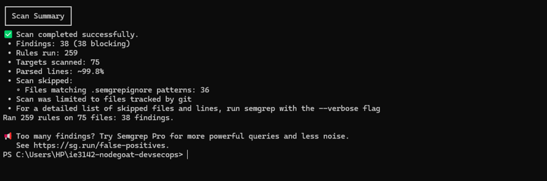  
*Figure 1 — Local Semgrep terminal output (`--config=auto` run, 38 findings — secondary/non-enforced scan; see note above)*

---

## 1. STRIDE and OWASP Category Mapping (cross-reference to `docs/threat-model.md`)

Every application-layer threat in the threat model corresponds to an OWASP Top 10 category (A1–A10) and has been fully demonstrated. T13 is an infrastructure-level threat and is not exploited (see `docs/threat-model.md`).

| Threat Model ID | OWASP Category | Vulnerability Title | Exploitation Status | Fix Status |
| :--- | :--- | :--- | :--- | :--- |
| **T1** | A2.2 | Username Enumeration | ✅ Demonstrated (Section 4) | Open |
| **T2** | A5 | Unauthenticated MongoDB Connection | ✅ Demonstrated (Section 3) | Open |
| **T3** | A8 | Disabled CSRF Protection | ✅ Demonstrated (Section 3) | Open |
| **T4** | A5 | Clickjacking / Disabled Frame Protection | ✅ Demonstrated (Section 3) | Open |
| **T5** | A1 | NoSQL Injection | ✅ Demonstrated (Section 2) | ✅ Fixed and re-tested |
| **T6** | A2.1 | Plaintext Password Storage | ✅ Demonstrated (Section 4) | ✅ Fixed and re-tested |
| **T7** | A2.3 | Insecure Cookie Attributes | ✅ Demonstrated (Section 4) | Open |
| **T8** | A2.4 | Weak Password Policy | ✅ Demonstrated (Section 4) | Open |
| **T9** | A2.5 | Missing Session Idle Timeout | ✅ Demonstrated (Section 4) | Open |
| **T10** | A3 | Stored XSS | ✅ Demonstrated (Section 2) | Open |
| **T11** | A4 | Insecure Direct Object Reference | ✅ Demonstrated (Section 2) | ✅ Fixed and re-tested |
| **T12** | A7 | Missing Function-Level Access Control | ✅ Demonstrated (Section 2) | ✅ Fixed and re-tested |
| **T13** | — | AppRole Credential Flow Compromise | ⬛ Identified, not exploited (infrastructure-level — see `docs/threat-model.md`) | Partly mitigated (Gitleaks gate) |
| **T14** | A1 | Server-Side Code Injection via `eval()` | ✅ Demonstrated during remediation (Section 2) | ✅ Fixed and re-tested |
| **T15** | A10 | Open Redirect (`/learn`) | ✅ Demonstrated during remediation (Section 2) | ✅ Fixed and re-tested |

---

## 2. Core Vulnerabilities (exploit-and-fix set)

### A1 — NoSQL Injection (Server-Side JavaScript) — T5

* **Target endpoint:** `/allocations` → Stocks Threshold field
* **Attack method:** Submitted a payload that alters the underlying MongoDB query logic: `1'; return 1 == '1`
* **Observed impact:** Overrides the query filter constraint and returns unauthorised database records belonging to other users.
* **Vulnerable location:** `app/data/allocations-dao.js`, `getByUserIdAndThreshold` — the threshold parameter is interpolated directly into a `$where` clause without validation.
* **Required remediation:** Replace raw string evaluation with explicit numeric casting (`parseInt`) and a bounds check before the value reaches the query.
* **Status:** ✅ Fixed and re-tested (see below).

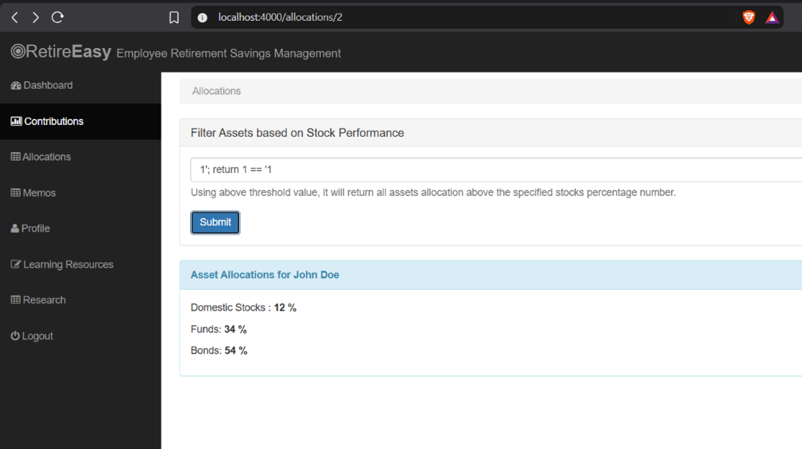  
*Figure 2 — Submitting the payload in the Threshold field*

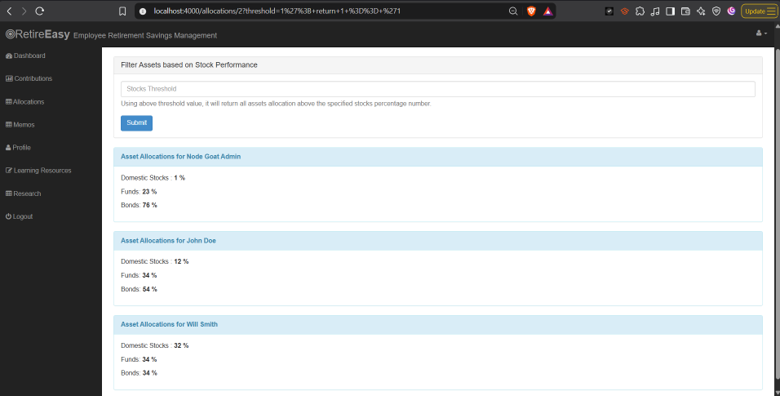  
*Figure 3 — Query returns unauthorised database records for all users*

* **Secondary instance — Denial of Service via the same field:** Submitting `';while(true){};` into the same `$where`-evaluated field traps the Node.js event loop until MongoDB aborts execution. Same vulnerable location and same fix (removing dynamic `$where` string evaluation resolves both).

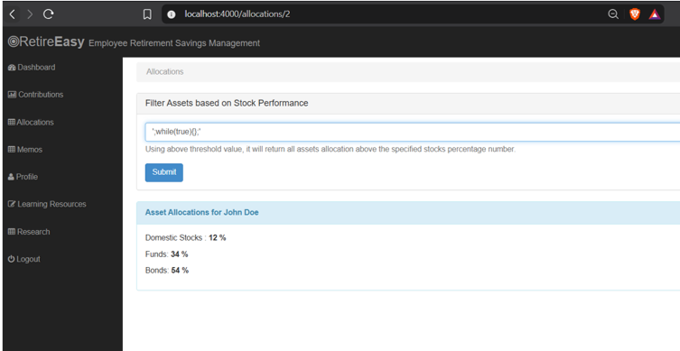  
*Figure 4 — Submitting an infinite-loop payload*

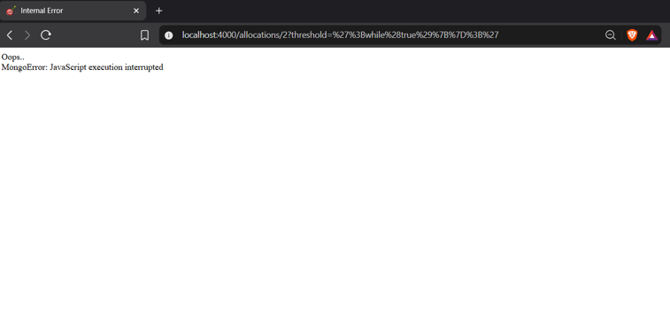  
*Figure 5 — MongoDB aborts execution after the payload runs*

**Fix applied.** In `app/data/allocations-dao.js` the threshold is trimmed and must be a plain decimal number within 0–99; anything else raises an `INVALID_THRESHOLD` error, which the route turns into HTTP 400 with the message "Invalid stock threshold: enter a number from 0 to 99". Dynamic `$where` string evaluation was replaced by a native query, which removes the mechanism behind both the data-disclosure payload and the infinite-loop payload.

**Retest.** The payload `0' || '1' == '1` submitted on `/allocations/2` returned the Admin, John Doe and Will Smith allocations before the fix. After the first rebuild it still disclosed all three users, which showed the running container was not yet built from the corrected source; after saving the source and rebuilding, the same payload was rejected. The infinite-loop payload was not re-executed against the fixed build; removing `$where` removes the mechanism it relies on. Semgrep stayed at 37 findings (no rule targets this pattern).

---

### A3 — Stored Cross-Site Scripting (XSS) — T10

* **Target endpoint:** `/profile` → First Name / Last Name fields
* **Attack method:** Injected `<script>alert('XSS Exploit')</script>` into editable profile fields.
* **Observed impact:** Payload persists in MongoDB and renders unescaped in the navigation header, executing JavaScript in the browser of any user who navigates the affected pages.
* **Vulnerable location:** `server.js` — Swig template engine initialised with `autoescape: false`.
* **Required remediation:** Set `swig.setDefaults({ autoescape: true })` and apply input sanitisation before database insertion.
* **Status:** Open — documented and evidenced; not remediated in this iteration.

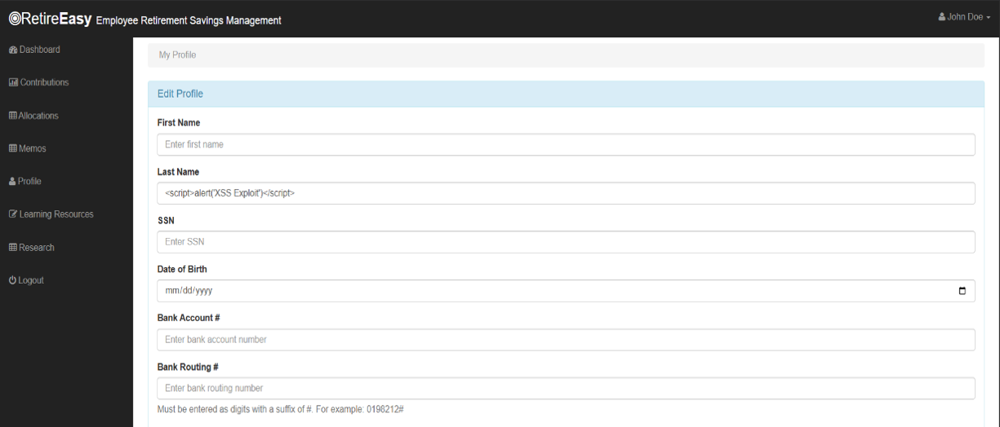  
*Figure 6 — Injecting a script tag into the Last Name field*

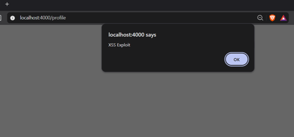  
*Figure 7 — Pop-up confirming script execution when navigating pages*

---

### A4 — Insecure Direct Object Reference (IDOR) — T11

* **Target endpoint:** `/allocations/{userId}`
* **Attack method:** Authenticated as a standard user (`userId=2`), then manually changed the URL path to `/allocations/1`.
* **Observed impact:** Server returns the Administrator’s allocation details without verifying the route parameter against the authenticated session.
* **Vulnerable location:** `app/routes/allocations.js`, `displayAllocations` — the handler trusts `req.params.userId` instead of `req.session.userId`.
* **Required remediation:** Source the user identifier from `req.session.userId` server-side rather than the URL parameter.
* **Status:** ✅ Fixed and re-tested (see below).

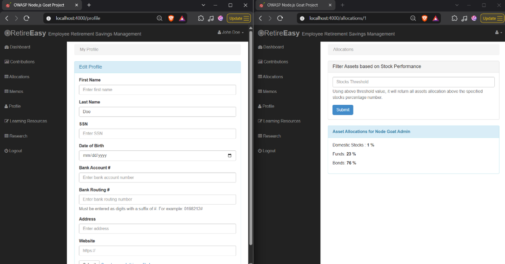  
*Figure 8 — Authenticated as a standard user, manually navigating to another user’s allocation URL*

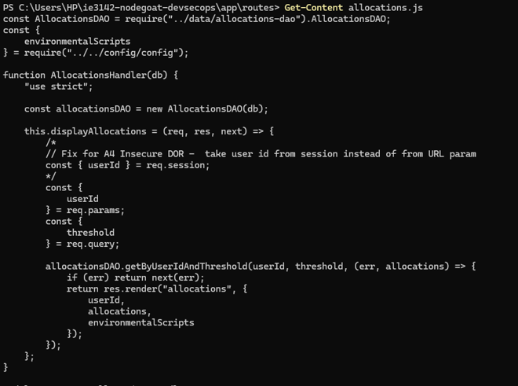  
*Figure 9 — The insecure direct object reference in the route handler*

**Fix applied.** In `app/routes/allocations.js` the handler takes the user ID from `req.session.userId`, redirects to login if it is missing, and returns HTTP 403 with "Access denied" when the ID in the URL differs from the session's ID.

**Retest.** During remediation user1 (ID 2) changed `/allocations/2` to `/allocations/3` and received Will Smith's allocations before the fix; after the fix the same edit shows "Access denied" and the user's own page still loads. Semgrep stayed at 37 findings (no rule covers a missing ownership check).

---

### A7 — Missing Function-Level Access Control — T12

* **Target endpoint:** `/benefits` (administrative dashboard)
* **Vulnerable files:** `app/routes/index.js`, `app/routes/admin.js`
* **Attack method:** Authenticated as a standard non-administrative user and navigated directly to `http://localhost:4000/benefits`.
* **Observed impact:** The application renders administrative controls and allows data modification without checking `req.session.user.isAdmin`.
* **Vulnerable location:** `app/routes/index.js` — the `/benefits` routes are registered with `isLoggedIn` only; the `isAdmin` middleware exists but is not attached.
* **Required remediation:** Attach `isAdmin` alongside `isLoggedIn` on both the GET and POST `/benefits` route handlers.
* **Status:** ✅ Fixed and re-tested (see below).

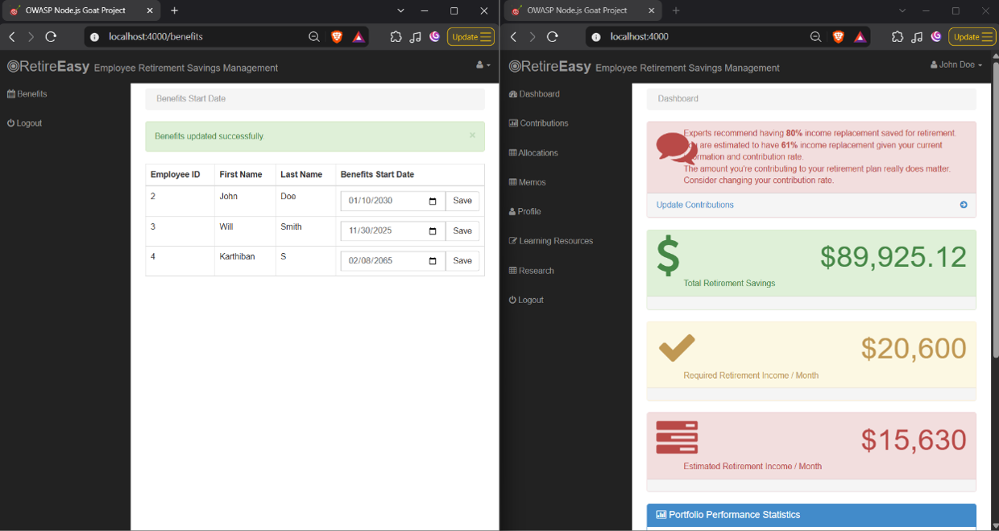  
*Figure 10 — A standard user navigating directly to /benefits and modifying data*

**Fix applied.** In `app/routes/index.js` the existing `isAdmin` middleware was added after `isLoggedIn` on both the GET and the POST handlers for `/benefits`.

**Retest.** Before the fix, John Doe (a standard user) opened `/benefits` and changed Will Smith's benefit start date. After the fix a normal user is sent back to `/login`; a stale form POST from the normal user's session left the stored date unchanged, as an administrator's re-read showed, and the administrator can still save. Semgrep stayed at 44 findings (one line number moved, none added or removed; no rule covers missing function-level authorisation).

---

### A1 — Server-Side Code Injection Through eval() — T14

*Found during the secure-coding phase; not in the original assessment.*

* **Target endpoint:** `/contributions` (POST, pre-tax / after-tax / Roth fields)
* **Attack method:** Authenticated as a standard user (John Doe) and entered the arithmetic expression `5+5` as the Pre-Tax percentage, then submitted the form.
* **Observed impact:** The server evaluated the expression as JavaScript and the page displayed `10%`, proving that submitted text is executed on the server. The same channel accepts arbitrary JavaScript, giving server-side code execution with the privileges of the application process.
* **Vulnerable location:** `app/routes/contributions.js`, `handleContributionsUpdate` — the submitted values were passed to `eval()` to convert them to numbers.
* **Required remediation:** Remove `eval()`, parse each value as a number and range-check it.

**Fix applied.** All `eval()` calls were removed from the contributions handler. Each value is now parsed as a number and range-checked before it is stored; invalid input is rejected with the message "Invalid contribution percentages".

**Retest.** The same input `5+5` is now rejected with "Invalid contribution percentages" and nothing is evaluated. A valid submission (2 / 2 / 2) still updates the contributions correctly.

**SAST effect.** Local `--config=auto` scan: 44 → 38 findings; the six `eval-detected` and code-string-concatenation findings across the three former `eval()` call sites no longer appear, and none were added.

**Status:** ✅ Fixed and re-tested.

<!-- Add evidence images once the PNGs are committed to docs/evidence/exploits/ -->
<!--  -->
<!--  -->

---

### A10 — Open Redirect Through the /learn Route — T15

*Found during the secure-coding phase; not in the original assessment.*

* **Target endpoint:** `/learn?url=<destination>`
* **Attack method:** While signed in, requested `/learn?url=https://example.com`.
* **Observed impact:** The application redirected the browser to the external site without any check. A crafted link therefore starts on the trusted NodeGoat domain and ends on an attacker-controlled page, which supports phishing.
* **Vulnerable location:** `app/routes/index.js`, `/learn` route — the handler redirected to `req.query.url` unchecked.
* **Required remediation:** Redirect only to an allow-listed destination and reject any other value.

**Fix applied.** The route now redirects to one fixed, approved Khan Academy URL (`https://www.khanacademy.org/economics-finance-domain/core-finance/investment-vehicles-tutorial/ira-401ks/v/traditional-iras`). Any other value in the `url` parameter returns HTTP 400 with "Invalid learning resource URL".

**Retest.** `/learn?url=https://example.com` now shows "Invalid learning resource URL" and no redirect occurs; the approved Khan Academy link still opens.

**SAST effect.** Local `--config=auto` scan: 38 → 37 findings; the `express-open-redirect` finding in `app/routes/index.js` no longer appears and nothing was added.

**Status:** ✅ Fixed and re-tested.

<!--  -->
<!--  -->

---

## 3. Additional Core Vulnerabilities — T2, T3, T4

These three complete the coverage of every application-layer threat in `docs/threat-model.md`.

### A5 — Unauthorised Access Through an Unauthenticated MongoDB Connection — T2

* **Target:** `nodegoat-mongo`, reachable only within the private `nodegoat-net` Docker network
* **Attack method:** Started a temporary container attached to the same Docker network as the application and connected directly to MongoDB with no credentials:
  ```bash
  docker run -it --rm --network nodegoat-net mongo:4.4 mongo --host mongo --eval "db.getSiblingDB('nodegoat').users.find().toArray()"
  ```
* **Observed impact:** Returned all database user records, including plaintext passwords, completely bypassing authentication controls.
* **Vulnerable location:** `docker-compose.yml` — the MongoDB instance lacks explicit authentication enforcement (`MONGO_INITDB_ROOT_USERNAME/PASSWORD`).
* **Required remediation:** Enable MongoDB authentication, create a dedicated least-privilege database user, and pass credentials securely via environment variables sourced from the project’s secrets-management mechanism.
* **Status:** Open — documented and evidenced; not remediated in this iteration.

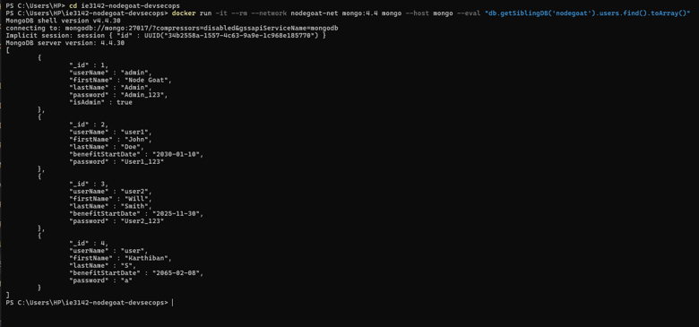  
*Figure 11 — Connecting directly to MongoDB from another container on the same network, with no credentials, and retrieving user records*

---

### A8 — Unauthorised State Change Through Disabled CSRF Protection — T3

* **Target endpoint:** `/contributions`
* **Attack method:** Logged into NodeGoat, then opened an external local HTML file containing an auto-submitting form targeting `http://localhost:4000/contributions` with modified allocation values — no interaction with the real NodeGoat form required.
* **Observed impact:** Contribution values were modified successfully without user interaction on the legitimate form, confirming that cross-site requests are processed blindly.
* **Vulnerable location:** `server.js` — the `csurf` import and middleware initialisation are commented out.
* **Required remediation:** Enable the `csurf` middleware, generate CSRF tokens for form views, and enforce token validation on all state-changing POST requests.
* **Status:** Open — documented and evidenced; not remediated in this iteration.

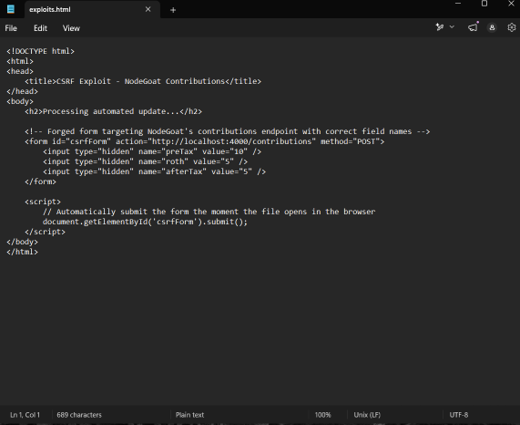  
*Figure 12 — The forged HTML page used to submit an unauthorised request*

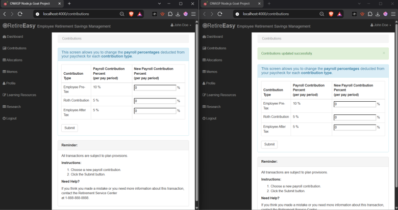  
*Figure 13 — Contributions page values modified via the external CSRF request*

---

### A5 — Clickjacking Through Disabled Frame Protection — T4

* **Target endpoint:** `/dashboard` (global layout)
* **Attack method:** Embedded the NodeGoat application inside an HTML inline frame (`<iframe src="http://localhost:4000/dashboard">`) hosted on a local test page.
* **Observed impact:** The dashboard rendered fully inside the third-party iframe without browser refusal, enabling UI redressing and clickjacking attacks.
* **Vulnerable location:** `server.js` — Helmet’s `frameguard()` security header module is commented out.
* **Required remediation:** Enable Helmet’s frame protection (`helmet.frameguard({ action: "deny" })`) or configure a Content Security Policy `frame-ancestors 'none'` header.
* **Status:** Open — documented and evidenced; not remediated in this iteration.

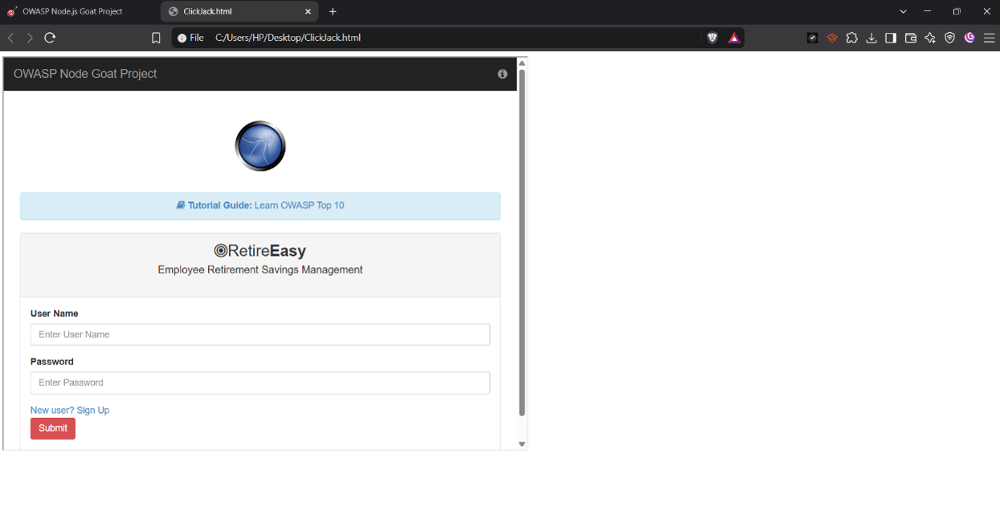  
*Figure 14 — NodeGoat’s dashboard loading inside a third-party iframe with no restriction*

---

## 4. Additional Secure Coding Findings (audit-based)

These are real weaknesses, identified by code/configuration audit with supporting evidence, but without the same attack-and-reattempt cycle as Sections 2 and 3, except A2.1 (T6), which was also fixed and re-tested. Each corresponds to a threat in `docs/threat-model.md`.

### A2.1 — Plaintext Password Storage — T6

* **Location:** `app/data/user-dao.js` (`addUser`, `validateLogin`)
* **Finding:** Passwords are stored and compared using direct string equality (`===`); the bcrypt-based fix exists in the codebase but is commented out.
* **Status:** ✅ Fixed and re-tested (see below).

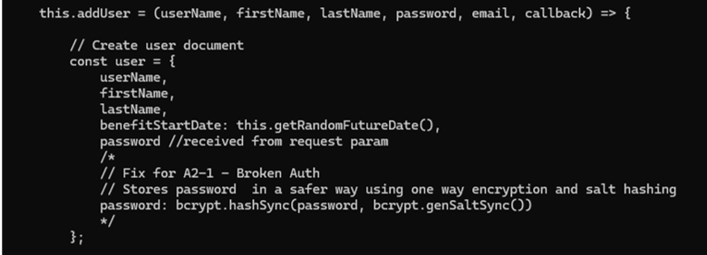  
*Figure 15 — `addUser` storing the password with no hashing*

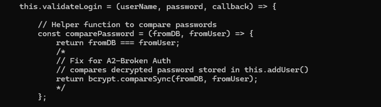  
*Figure 16 — `validateLogin` comparing passwords with `===` instead of a hash check*

**Fix applied.** `app/data/user-dao.js` now stores a salted bcrypt hash on signup (`bcrypt.hashSync(password, bcrypt.genSaltSync(12))`) and verifies it on login with `bcrypt.compareSync`. Because the running database already held plaintext passwords, `scripts/migrate-passwords.js` converted the four existing accounts once: it checks every record first, skips values that are already hashes, hashes the rest at cost 12 and aborts if a record changes during the run. A `mongodump` backup was taken first and is excluded from git and from the Docker image. `artifacts/db-reset.js` now seeds the three demo users as bcrypt hashes, so a fresh clone starts without plaintext passwords.

**Retest.** Before the fix a database query restricted to a disposable test account returned the plaintext password used at signup. After the fix the migration script reported four passwords converted, the same query showed a `$2a$12$` hash for the migrated account and for an account created through the signup form, and logins still worked, including the seeded users on a fresh database volume. Semgrep stayed at 37 findings (no rule covers plaintext password storage); the migration script was scanned with no findings, and three `detected-bcrypt-hash` findings in `artifacts/db-reset.js` flag the public demo hashes and are false positives.

---

### A2.2 — Username Enumeration — T1

* **Location:** `/login`
* **Finding:** Distinct error messages for an invalid username versus an invalid password allow account discovery.
* **Status:** Open — documented and evidenced; not remediated in this iteration.

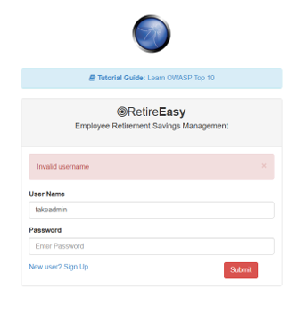  
*Figure 17 — “Invalid username” response*

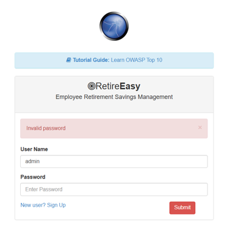  
*Figure 18 — “Invalid password” response for a known username*

---

### A2.3 — Insecure Cookie Attributes — T7

* **Location:** `server.js` session configuration
* **Finding:** The session cookie is missing the `Secure` attribute, confirmed via browser developer tools.
* **Status:** Open — documented and evidenced; not remediated in this iteration.

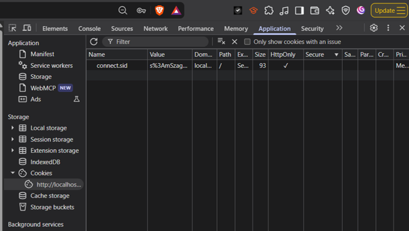  
*Figure 19 — Session cookie inspected via DevTools, Secure not set*

---

### A2.4 — Weak Password Policy — T8

* **Location:** `app/routes/session.js` (`PASS_RE = /^.{1,20}$/`)
* **Finding:** A one-character password was successfully registered and used to log in.
* **Status:** Open — documented and evidenced; not remediated in this iteration.

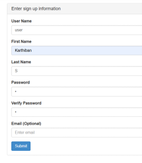  
*Figure 20 — Registering an account with a single-character password*

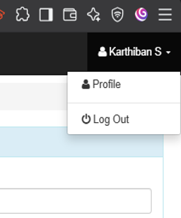  
*Figure 21 — Successfully logging in with the same weak password*

---

### A2.5 — Missing Session Idle Timeout — T9

* **Location:** `server.js` session configuration
* **Finding:** No `maxAge` is configured, so sessions remain valid indefinitely regardless of inactivity.
* **Status:** Open — documented and evidenced; not remediated in this iteration.

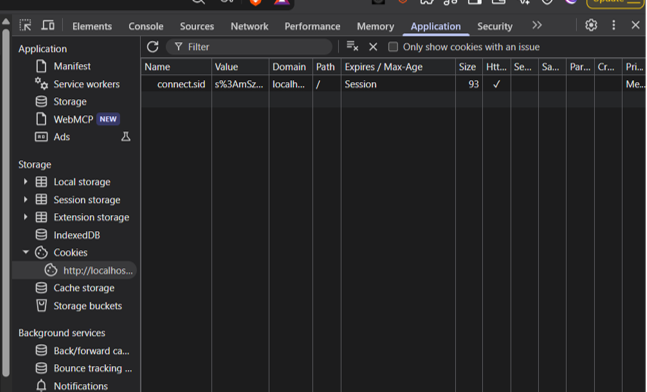  
*Figure 22 — Session cookie inspected via DevTools, no expiry/Max-Age set*

---

## 5. T13 — AppRole Credential Flow Compromise (not exploited)

T13, documented in `docs/threat-model.md`, concerns compromise of the Vault AppRole credential flow used for secrets provisioning. It is intentionally excluded from the exploit-and-fix set: no working exploit is demonstrated here, since doing so safely would require simulating a compromise of a running container to steal live credentials, rather than an external application-layer attack. Its recommended controls are infrastructure hardening measures (Vault policy scope, credential volume access, credential lifetime) rather than an application code fix. One of its recommended controls — preventing secrets from reaching source control — is already implemented and enforced via the Gitleaks secrets-scanning CI gate.

---

## 6. Handoff Checklist

- [x] Exploit T1–T12 and capture evidence
- [x] Find, exploit, fix and re-test T14 (eval injection) and T15 (open redirect)
- [x] Apply source code fixes for T5, T6, T11, T12, T14 and T15 and re-verify with the original exploit
- [x] Re-run the CI pipeline's SAST scan after the fixes: CI #20 baseline 15 findings (3 ERROR, 12 WARNING) → CI run #40, 11 findings (0 ERROR)
- [x] Local `--config=auto` series recorded: 44 → 44 → 38 → 37 → 37
- [ ] T1, T2, T3, T4, T7, T8, T9, T10 remain open — documented in this file and `docs/threat-model.md`, not remediated in this iteration
- [x] Threat model (`docs/threat-model.md`) covers T1–T15
- [x] T13 documented as identified-but-not-exploited (infrastructure-level, out of scope for this workstream)
